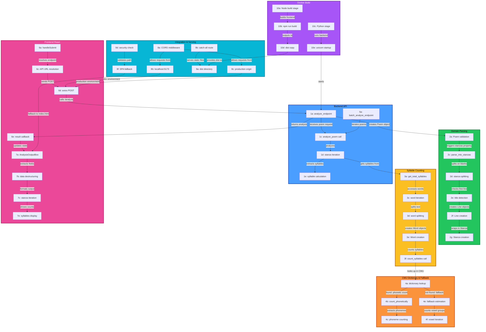

# Architecture

## Quick Reference

Oracle is a full-stack poetry analysis application using a layered architecture that separates parsing, domain logic, and presentation layers.

### System Flow


### Component Overview

**Backend (Python/FastAPI)**
- `api.py` - REST endpoints, CORS, static file serving
- `analyzer.py` - Analysis orchestration
- `poem_model.py` - Poem domain model with cached properties
- `parser.py` - Text parsing into structured objects
- `domain_objects.py` - Word, Line, Stanza models
- `syllable_counter.py` - CMU dictionary + fallback logic
- `main.py` - CLI entry point

**Frontend (React/Vite)**
- `App.jsx` - Main application component
- `UserInputBox.jsx` - Poem input form with API integration
- `AnalysisOutputBox.jsx` - Formatted results display
- Tailwind CSS for styling

**Infrastructure**
- Multi-stage Docker build (Node 20 → Python 3.12)
- FastAPI serves built React app from `/dist`
- Render deployment with environment-based configuration

### Key Data Flows

**CLI Flow:**
```
poems/*.txt
  → read_poem_folder_and_return_names()
  → write_poem_analysis()
  → Poem(text, filepath)
  → parse_into_stanzas() → list[Stanza]
  → analyze_poem() → metrics dict
  → write *_analysis.txt
```

**Web Flow:**
```
React form
  → axios POST /analyze
  → FastAPI endpoint
  → Poem object creation
  → Domain parsing (Stanza → Line → Word)
  → Syllable counting (CMU → fallback)
  → JSON response
  → Formatted output rendering
```

**Deployment:**
```
Docker Stage 1 (Node): Build React → /dist
Docker Stage 2 (Python): Copy /dist + run FastAPI
Container → Render platform
```

### Core Design Principles

- **Domain-driven structure** - Poem/Stanza/Line/Word objects over string manipulation
- **Thin API layer** - FastAPI endpoints are wrappers, no business logic
- **Single deployment** - Backend serves frontend static files
- **Separation of concerns** - Parsing, analysis, and presentation are independent modules

---

## Detailed Design History

### 1. Purpose of This Document

This document describes the current architecture of **Oracle** — a Python tool for syllable counting and metrical analysis of English poetry using the CMU Pronouncing Dictionary.

It serves three main purposes:

- to record **why** certain design decisions were made (especially important in a solo/learning project where memory fades quickly)
- to make future refactoring or feature additions easier by providing context
- to serve as a self-reflection and portfolio artifact showing architectural thinking

Last updated: January 2026 (web architecture expansion)

### 2. Initial Design and Constraints

**Starting point (late 2025):**
- Very simple goal: read .txt poem files → count syllables per line → write basic analysis
- No prior experience writing maintainable medium-sized Python projects
- Strong preference for planning on paper first, then coding
- Constraints:
  - Use only standard library + Poetry + pytest + NLTK (CMUdict)
  - ~~Keep it CLI-based, no web/UI~~ → Extended to web (FastAPI + React) while preserving CLI capability
  - Maximize learning: try dataclasses, cached properties, TDD-ish approach, good test coverage

## 3. Evolution of the Architecture

### 3.1 From String-Based Processing to Domain Objects

**Before November 24('Implementation of Poem dataclass' commit):**
- Everything done with strings and functions operating on strings
- Simple but inflexible:
  - No clear structure for poems, stanzas, lines, words
  - Hard to extend for new features (e.g., rhyme detection, variant syllable counts)
  - Code duplication and tangled logic
- Adding any new feature would require extra work and risk of breaking existing code

**Trigger for change:**
- Realized that future features (rhyme schemes, stress patterns, multiple pronunciation handling) need to reason about words/lines/stanzas as **objects**, not substrings
- Wanted to separate "what is a poem structurally" from "how do I analyze it"

**Change:**
- Introduced domain model: `Poem → list[Stanza] → list[Line] → list[Word]`
- Used `@dataclass` + `@cached_property` for clean, efficient access

**Outcome:**
- Much easier to reason about individual parts
- Tests became more focused and readable
- Adding new analysis dimensions became possible without breaking existing code

### 3.2 Separation of Parsing, Analysis, and Output

**After (current):**
- `parser.py` — only responsible for turning raw text into `Poem` object (title skipping, blank-line stanza detection)
- `analyzer.py` — takes `Poem`, walks domain objects, computes metrics
- `main.py` + `write_poem_analysis` — I/O and formatting
- `syllable_counter.py` — isolated phonetic + fallback logic

**Outcome:**
- Each module has single responsibility
- Easier to test in isolation
- Clearer mental model when adding features

### 3.3 Expansion to Web Architecture (FastAPI + React)

**Before January 2026:**
- CLI-only tool — sufficient for personal use but limited shareability
- No way for others to try the tool without Python/NLTK setup

**Trigger for change:**
- Wanted to learn FastAPI and React+Vite as practical portfolio skills
- Realized a web interface would make the tool accessible to non-technical users
- Curious about what backend design decisions matter when building for a frontend consumer

**Change:**
- Added FastAPI layer (`api.py`) exposing analysis as REST endpoints
- Built React+Vite frontend with Tailwind for styling
- Backend serves built frontend as static files (single deployment)

**Key learnings about backend-frontend interface:**
- API responses need to be structured for frontend consumption (consistent shapes, clear error handling)
- CORS configuration matters immediately in development
- Pydantic models serve double duty: validation + API documentation
- Health endpoint valuable for deployment monitoring
- Good Modular Backend with Separation of Concerns needs very little to no changes to connect with API and frontend

**Outcome:**
- Core domain logic unchanged — API is a thin layer over existing analyzer
- Frontend can evolve independently of backend
- Same analysis code powers CLI and web

## 4. Current Architectural Overview

### CLI Flow (original)
```
poems/*.txt
  → read_poem_folder_and_return_names()
  → write_poem_analysis()
  → Poem(text, filepath)
  → parse_into_stanzas() → list[Stanza]
  → analyze_poem() → metrics dict
  → write analysis.txt
```

### Web Flow (new)
```
React Frontend (Vite + Tailwind)
  → axios POST /analyze
  → FastAPI (api.py)
  → Poem + analyze_poem()
  → JSON response
  → render in browser
```

### Deployment
```
Docker multi-stage build:
  Stage 1: Node 20 → build React frontend → /dist
  Stage 2: Python 3.12-slim → FastAPI + /dist → single container
  → Render (or any container platform)
```

Core layers:
- **Domain layer** — `Poem`, `Stanza`, `Line`, `Word` (dataclasses)
- **Analysis layer** — syllable counting (future: meter/rhyme detection)
- **API layer** — FastAPI endpoints, Pydantic request/response models
- **Frontend layer** — React components, Tailwind styling
- **Infrastructure layer** — file I/O (CLI), static file serving (web), Docker packaging

## 5. Key Architectural Decisions

### ADR-001: Introducing Domain Objects
- **Context**  
  Switching from string-based operations to working with dataclasses

- **Decision**  
  Implementing `Poem > Stanza > Line > Word` data structure using `@dataclass` and `@cached_property`

- **Rationale**  
  - String operations became insufficient for future expansions (rhyme schemes, stress patterns, multiple pronunciation variants)  
  - Wanted to write analysis per stanza/line/word independently  
  - dataclasses provide clean syntax, type hints, and are easy to test

- **Consequences**  
  - Positive: modularity, better testability, easier to add features (e.g. `get_all_syllable_variants()`)  
  - Negative: slightly more code upfront, small performance overhead (acceptable for this scale)  
  - Allowed splitting `get_total_syllables()` and `get_all_syllable_variants()` instead of union return types

### ADR-002: Test-Informed Development Instead of Strict TDD
- **Context**  
  Wanted high test coverage but found pure TDD (write test → red → implement → green → refactor) too rigid during learning phase

- **Decision**  
  Mostly "test after" + "test during" approach:  
  - Write core logic first (often on paper → code)  
  - Write comprehensive tests immediately after (or in parallel for tricky parts)  
  - Use tests to explore edge cases and document behavior

- **Rationale**  
  - Learning phase — strict TDD felt like fighting the language  
  - Tests written after still catch regressions and force cleaner APIs  
  - High coverage (>85–90%) achieved without burning out

- **Consequences**  
  - Positive: good coverage, confidence in refactoring (e.g. domain split)  
  - Negative: some tests written later are integration-style instead of pure unit  
  - Acceptable tradeoff for first medium-sized project


### ADR-003: Splitting Syllable Methods Instead of Union Return Types

- **Context**  
  `get_total_syllables(use_all_variants)` returned `int | list[list[int]]` → caused mypy pain and unclear caller code

- **Decision**  
  Split into two public methods with `get_syllable_counts()` as shared implementation:
  - `get_total_syllables() → int` (public)
  - `get_all_syllable_variants() → list[list[int]]` (public)
  - `get_syllable_counts(use_all_variants) → list[int] | list[list[int]]` (internal helper)

- **Rationale**  
  Callers get clean, single-purpose methods without union types. The complexity of the union return lives in one internal method instead of spreading through the codebase.

- **Consequences**
  Public API is simpler and more type-safe. Internal implementation can change without affecting callers. Slightly more methods, but each has clear intent.

### ADR-004: Adding FastAPI as Web Backend

- **Context**
  Wanted to expose the analyzer as a web service for accessibility and to learn backend web development

- **Decision**
  Use FastAPI with Pydantic models for request/response validation

- **Rationale**
  - FastAPI is modern, well-documented, and good for learning
  - Have used it before and recalled it being slim and relatively easy to use
  - Automatic OpenAPI docs (`/docs`) for free
  - Pydantic integrates naturally with existing dataclass-based domain
  - Async support available if needed later

- **Consequences**
  - Positive: clean API with validation, auto-generated docs, easy deployment
  - Positive: forced clearer thinking about what data frontend actually needs
  - Negative: additional dependencies (fastapi, uvicorn, pydantic)
  - API layer is intentionally thin — no business logic lives there

### ADR-005: Adding React + Vite Frontend

- **Context**
  Wanted a modern frontend to make the tool accessible and to learn React since learning through course was not enough to retain knowledge

- **Decision**
  React 19 + Vite + Tailwind CSS, served as static files from FastAPI

- **Rationale**
  - React is industry-standard, good investment for learning
  - Vite provides fast dev experience with HMR
  - Tailwind allows rapid styling without CSS complexity
  - Single deployment: FastAPI serves built frontend from `/dist`

- **Consequences**
  - Positive: interactive UI, accessible to non-technical users
  - Positive: frontend and backend can be developed/tested independently
  - Negative: JavaScript toolchain complexity (node_modules, build step)
  - Acceptable: frontend is intentionally simple — no routing, no state management library

### ADR-006: Docker for Deployment

- **Context**
  Needed to deploy combined frontend + backend to Render hosting

- **Decision**
  Use Docker with multi-stage build instead of platform-native buildpacks

- **Rationale**
  - Multi-stage build cleanly handles both Node (frontend build) and Python (backend) in one image
  - Reproducible builds — same environment locally and in production
  - Portable across container platforms (Render, Railway, Fly.io, etc.)
  - Explicit control over dependencies and build steps

- **Consequences**
  - Positive: single deployable artifact containing everything
  - Positive: not locked into any specific hosting platform's build system
  - Negative: need to maintain Dockerfile, slightly more setup than platform defaults
  - Acceptable: Dockerfile is straightforward and well-documented

## 6. Testing and Validation Strategy

**Backend (Python):**
- pytest + comprehensive assertions on structure, content, edge cases
- Focus: unit tests for domain objects & syllable counter, integration for parsing & full analysis flow
- Goal: >85% coverage on core logic
- No mocking of external libs (NLTK) — accept it as trusted dependency
- tmp_path fixture for all file I/O tests

**API:**
- FastAPI's `/health` endpoint for runtime verification
- Manual testing via `/docs` (Swagger UI) during development
- API tests not yet implemented — future consideration

**Frontend:**
- No automated tests yet — acceptable for current scope
- Manual browser testing during development


## 7. Tradeoffs and Known Limitations

**Core analysis:**
- English-only (CMUdict) — intentional scope limitation
- No support for multiple pronunciation selection yet (uses first variant)
- No rhyme/stress pattern detection (planned)
- Performance not optimized (irrelevant for <1000 poems)
- NLTK download required — documented in README

**Web architecture:**
- Single deployment model (API serves frontend) — simple but limits independent scaling
- No authentication — intentional for public demo tool
- No API versioning — will address if breaking changes needed
- Frontend has no tests yet — acceptable for current scope
- No CLI arguments yet (folder hardcoded with default) — lower priority now that web exists

## 8. Future Considerations

**Analysis features:**
- Support multiple pronunciation variants + best-fit meter detection
- Rhyme scheme detection (end-word phoneme comparison)

**Web/infrastructure:**
- Add frontend tests (React Testing Library or Playwright)
- API tests with pytest + httpx
- Consider API versioning if public usage grows

**Lower priority (now that web exists):**
- CLI arguments (`argparse` or `typer`): folder, output format, options